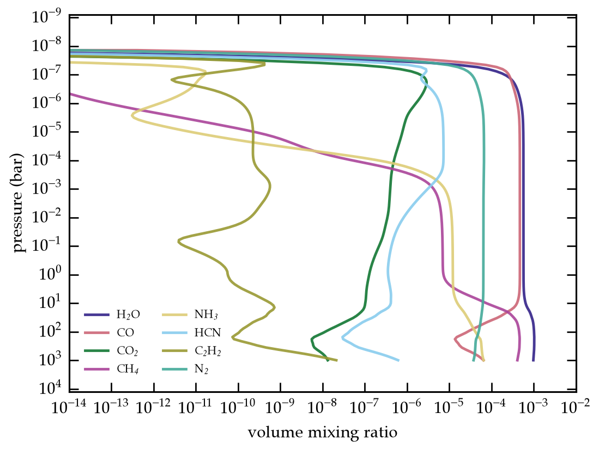

# VULCAN-JAX

VULCAN-JAX is a JAX port of
[VULCAN](https://github.com/exoclime/VULCAN). It solves one-dimensional
chemical kinetics in planetary atmospheres. The goal for this project is to make a
(close to) fully auto-differentiable version of VULCAN, which will be VULCAN 3.0. A paper on
the code is currently in progress.

The package supports:

- thermochemistry and photochemistry;
- eddy and molecular diffusion;
- condensation and ion chemistry;
- CPU and GPU execution;
- batched models with `jax.vmap`;
- forward derivatives through the time integration; and
- steady-state reaction sensitivities.

VULCAN-JAX is designed to take the same API as VULCAN (with one change to use YAML files). It writes the standard
`.vul` output format. The test suite compares the port with pinned VULCAN
inputs and reference results.

## Install

VULCAN-JAX needs Python 3.10 or later. FastChem also needs a C++ compiler.

```bash
python -m pip install \
  -i https://test.pypi.org/simple/ \
  --extra-index-url https://pypi.org/simple/ \
  vulcan-jax
```

For development:

```bash
git clone https://github.com/imalsky/jax-vulcan.git
cd jax-vulcan
python -m pip install -e ".[dev,plot]"
python -m pytest tests -q
```

## Run a model

```bash
vulcan-jax --config default
vulcan-jax --config W39b
```

Results go to `output/`. Configuration files use YAML and are stored in
`src/vulcan_jax/configs/`. A file in `./configs/` with the same name overrides
the packaged file.

The reaction network is fixed when Python first imports the package. Set
`VULCAN_JAX_NETWORK` before the first import if you need another network.
See [`examples/quickstart.ipynb`](examples/quickstart.ipynb) for the Python
interface and the derivative examples.

## Example

Run the default HD 189733 b model from Python and plot the converged
abundances. The run takes about a minute on a laptop CPU.

```python
import numpy as np
import matplotlib.pyplot as plt
import vulcan_jax
from vulcan_jax import chem_funs, legacy_io, op_jax, outer_loop

# Build the initial state and integrate to convergence. Pass the same
# cfg to both the runner and the writer.
cfg = vulcan_jax.make_config()
rs = vulcan_jax.RunState.with_pre_loop_setup(cfg)
integ = outer_loop.OuterLoop(op_jax.Ros2JAX(), legacy_io.Output(cfg=cfg), cfg=cfg)
rs = integ(rs)

# Plot volume mixing ratios against pressure.
p_bar = np.asarray(rs.atm.pco) / 1e6
ymix = np.asarray(rs.step.ymix)
species = {"H2O": "H$_2$O", "CO": "CO", "CO2": "CO$_2$", "CH4": "CH$_4$",
           "NH3": "NH$_3$", "HCN": "HCN", "C2H2": "C$_2$H$_2$", "N2": "N$_2$"}
for sp, label in species.items():
    plt.loglog(ymix[:, chem_funs.spec_list.index(sp)], p_bar, label=label,
               lw=2.3, alpha=0.9)
plt.xlim(1e-14, 1e-2)
plt.gca().invert_yaxis()
plt.xlabel("volume mixing ratio")
plt.ylabel("pressure (bar)")
plt.legend(loc="lower left", ncol=2, fontsize="small")
plt.show()
```



The scripts in [`examples/`](examples/) apply `jax.vmap` and forward- and
reverse-mode derivatives to the same model.

## Limits

- Only the Rosenbrock-2 solver is ported.
- Reverse-mode differentiation does not pass through the time-integration
  loop. Use forward mode or the steady-state adjoint.
- FastChem initialization is not differentiable.
- Condensation can run in the forward model, but it is not validated for
  gradient inference.
- VULCAN-JAX includes documented corrections and deliberate differences from
  VULCAN. Check these before a strict parity study.

## Papers and citation

If you publish results from VULCAN-JAX, cite the original VULCAN papers:

- [Tsai et al. (2017), ApJS 228, 20](https://doi.org/10.3847/1538-4365/228/2/20)
- [Tsai et al. (2021), ApJ 923, 264](https://doi.org/10.3847/1538-4357/ac29bc)

If the run uses FastChem initialization, also cite
[Stock et al. (2018)](https://doi.org/10.1093/mnras/sty1531).
Record the VULCAN-JAX version, configuration, network, and input-data versions
with the result.

## Support and license

Open a [GitHub issue](https://github.com/imalsky/jax-vulcan/issues) and include
the command, configuration, package versions, and full error message.

VULCAN-JAX is released under GPLv3.
